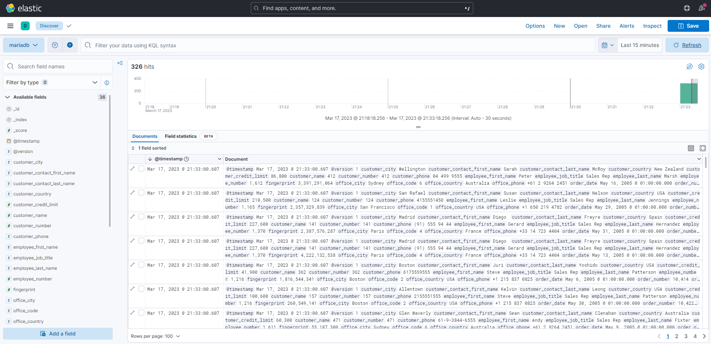
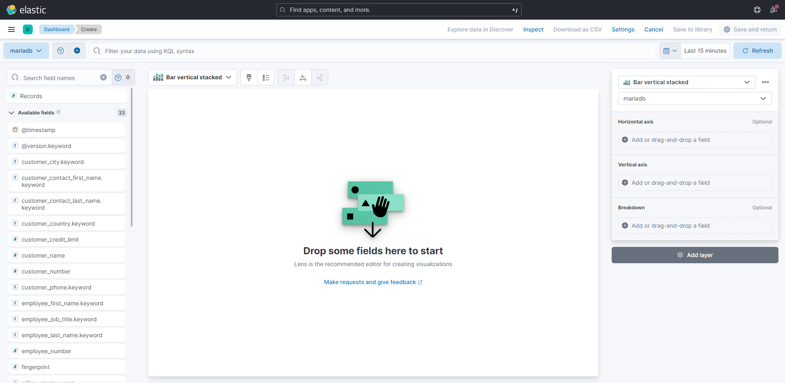
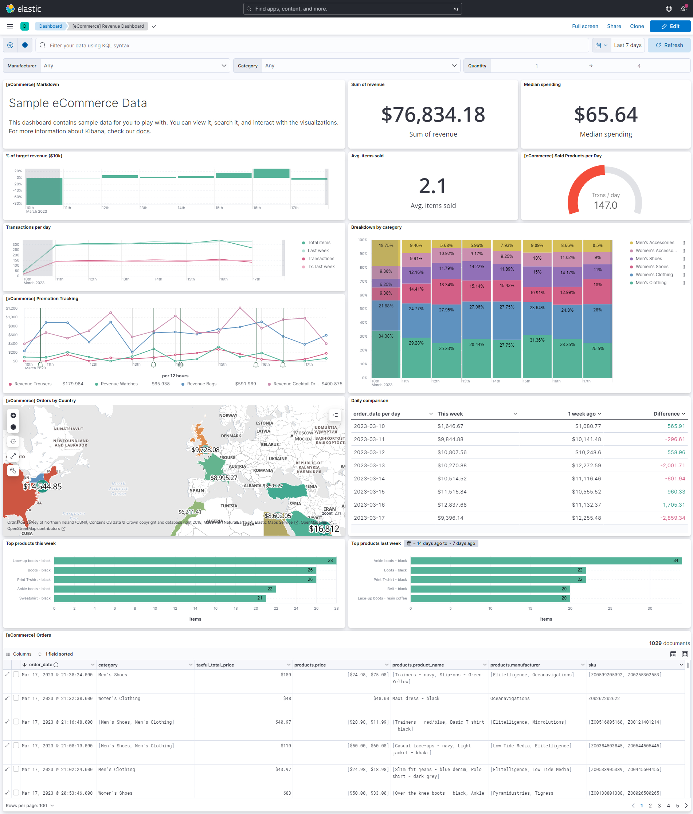

# Bringing it all together

## I. Executing the workflow

### **1. Starting the stack**

Since everything is pre-configured already, this is as simple as running the following command from the [root directory](../) of the project.

```bash
make up
```

That command will effectively start the following applications in docker containers:

1. MariaDB with phpmyadmin accessible at http://localhost:8080
2. Elasticsearch, Kibana and Logstash.
   - Kibana is accessible at http://localhost:5601
   - Elasticsearch healthcheck route is at http://localhost:9200
   - Logstash healthcheck route is at http://localhost:9600

Note that it might take some time for the services to be up.

Once all services are up and running, you can connect to [phpmyadmin](http://localhost:8080) with the following credentials and explore the `retailer_db` database:

```bash
Server: mariadb
Username: root
Password: root
```


### **2. Logstash pipeline**

Logstash is [configured](../compose/init/logstash/conf.d/logstash.conf) to:

1. Read the input from MariaDB using the JDBC driver
2. Filter the duplicated data by creating a HASH from all primary keys
3. Feed it to Elasticsearch as its output.

Once that's done, the data wil finally be indexed in Elasticsearch and ready to be visualized.

## II. Visualization with Kibana

### **1. Requirement**

One small requirement before creating dashboards is [creating a data view](https://www.elastic.co/guide/en/kibana/current/data-views.html) which helps keeping things organized.

### **2. Discover Tab**

After that is taken care of, the data can finally be checked out under the [Discover tab](https://www.elastic.co/guide/en/kibana/current/discover.html) in analytics, but it does not look very clean.



### **3. Dashboards Tab**

To cleanly visualize the data, we need to create our own dashboards from the [Dashboards tab](https://www.elastic.co/guide/en/kibana/current/dashboard.html), which will then let us create our own visualizations.



Kibana offers a lot of layer visualization types, which when combined, allow us to create dashboards similar to this


