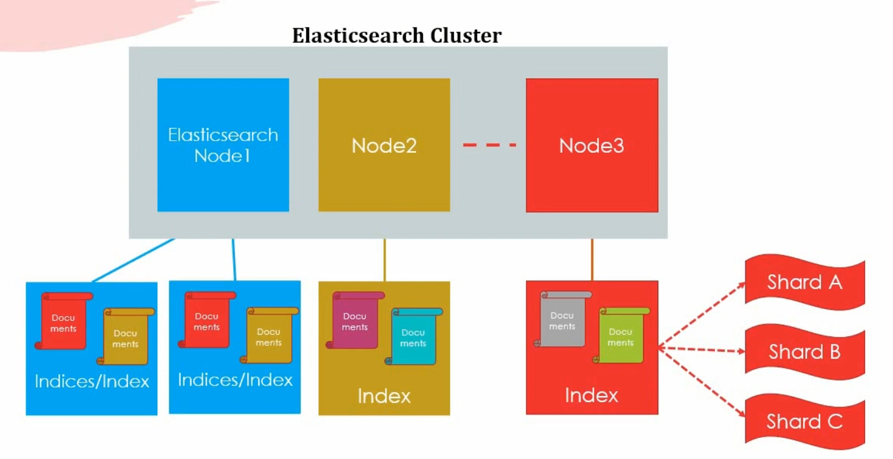
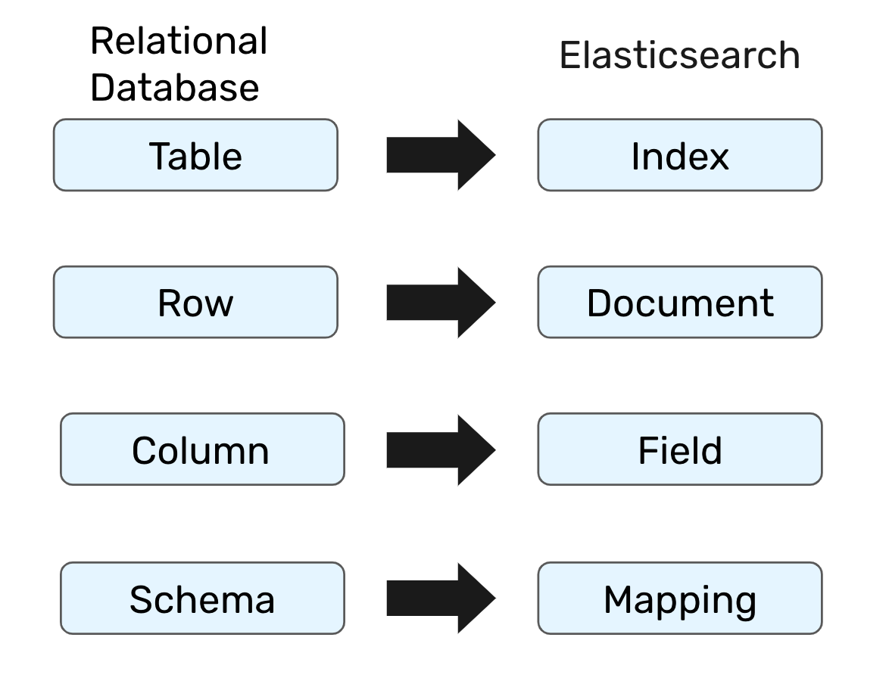
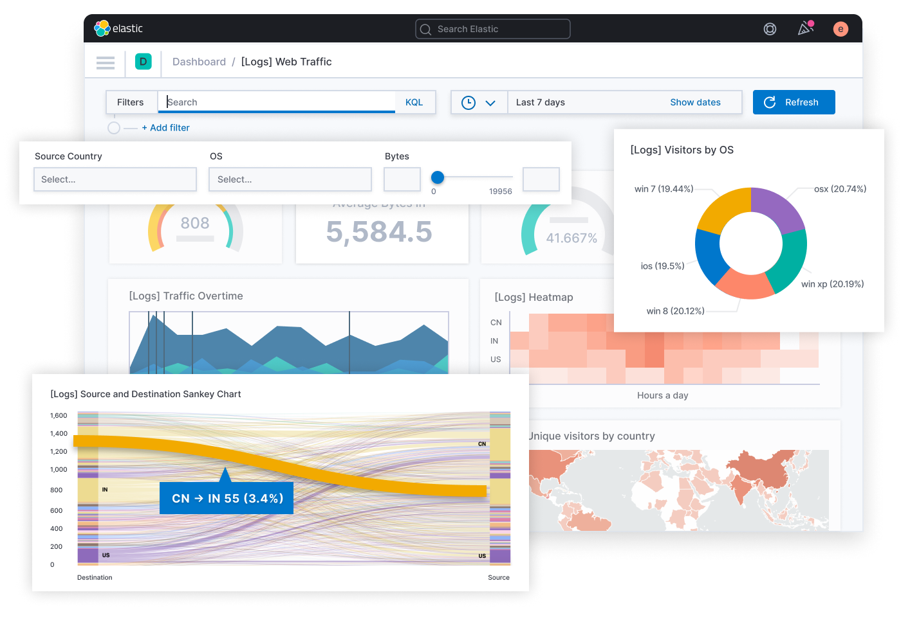
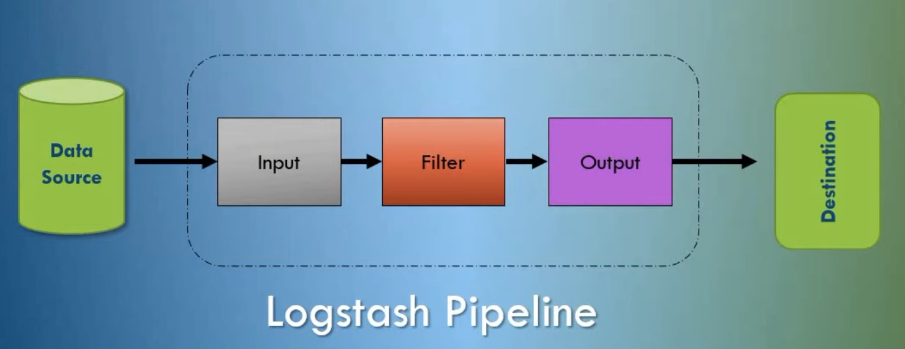

# Elasticstack or ELK

The [elasticstack](https://www.elastic.co/elastic-stack/) consists of Elasticsearch, Kibana, Beats and Logstash.
We define very briefly what some of those components are right below.

## **I. In a nutshell**

### **1. Elasticsearch**

- Distributed open-source search & analytics engine.
- Used to store, search and quickly analyze huge amounts of data.
  

- Analogy to relational databases
  

### **2. Kibana**

- Frontend application that sits on top of Elasticsearch.
- Provides search and data visualization capabilities.
  

### **3. Logstash**

- Data collection engine with real-time capabilities
- Unifies data from separate sources and normalizes it
  

## **II. Specifically**

In our case, we will be using some major parts of the elasticstack for **data warehousing**, **the ETL process**, in addition to **the visualization** with Kibana.

_Proceed to [the ETL process](../docs/extract-transform-load.md) for more details._

##### [To table of contents](../README.md)
