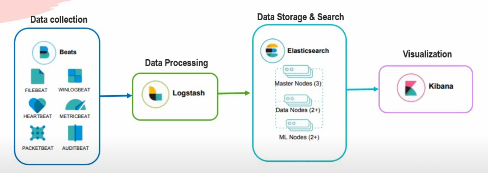

# Extract Transform Load (ETL)

ETL stands for **extract**, **transform** and **load**.
It is a data integration process that combines multiple data sources into a single consistent data store that is then loaded into a **data warehouse**, [according to IBM.](https://www.ibm.com/topics/etl)

## In our case

There are [a lot of ETL tools](https://blog.hubspot.com/website/etl-tools) one can use.
In our case however, we will be using:

- [Elasticsearch](https://www.elastic.co/) as the data warehouse to load our data in.
- [Logstash](https://www.elastic.co/logstash/) for extracting, transforming and loading the data.
- [Kibana](https://www.elastic.co/kibana/) as the data visualization tool.

The process can be summarized in these two steps:

1. A Logstash pipeline continuously reads data from MySQL/MariaDB, filters it, then loads it into Elasticsearch.
2. Kibana tools such as the dashboards and the Kibana Query Language will help us better visualize our data.

_Proceed to [the bringing it all together](../docs/bringing-it-all-together.md) document for a practical example._

##### [To table of contents](../README.md)
